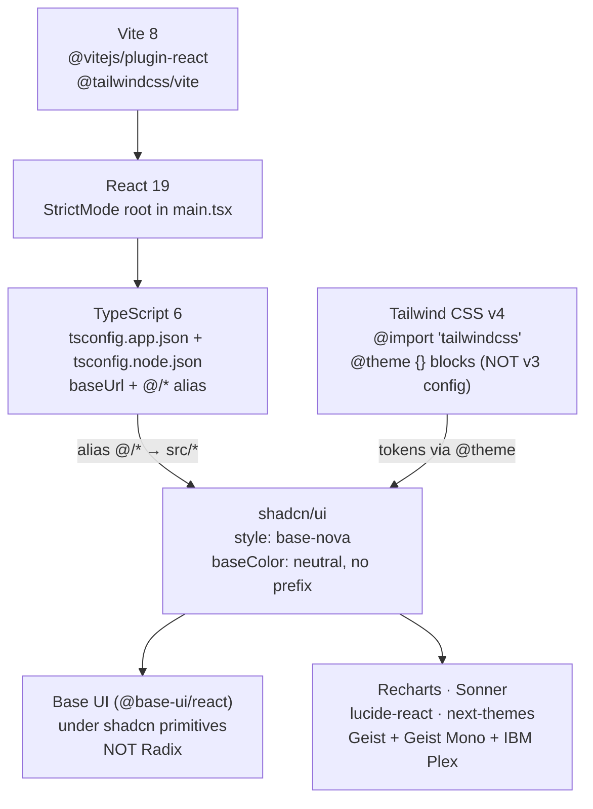
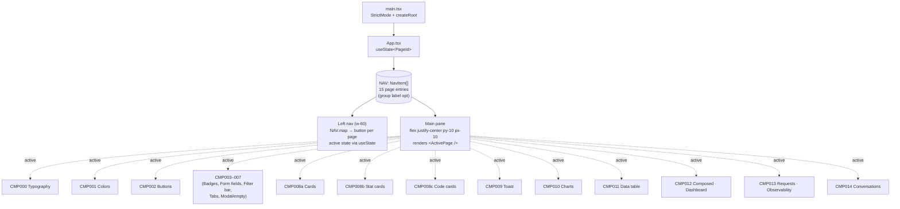
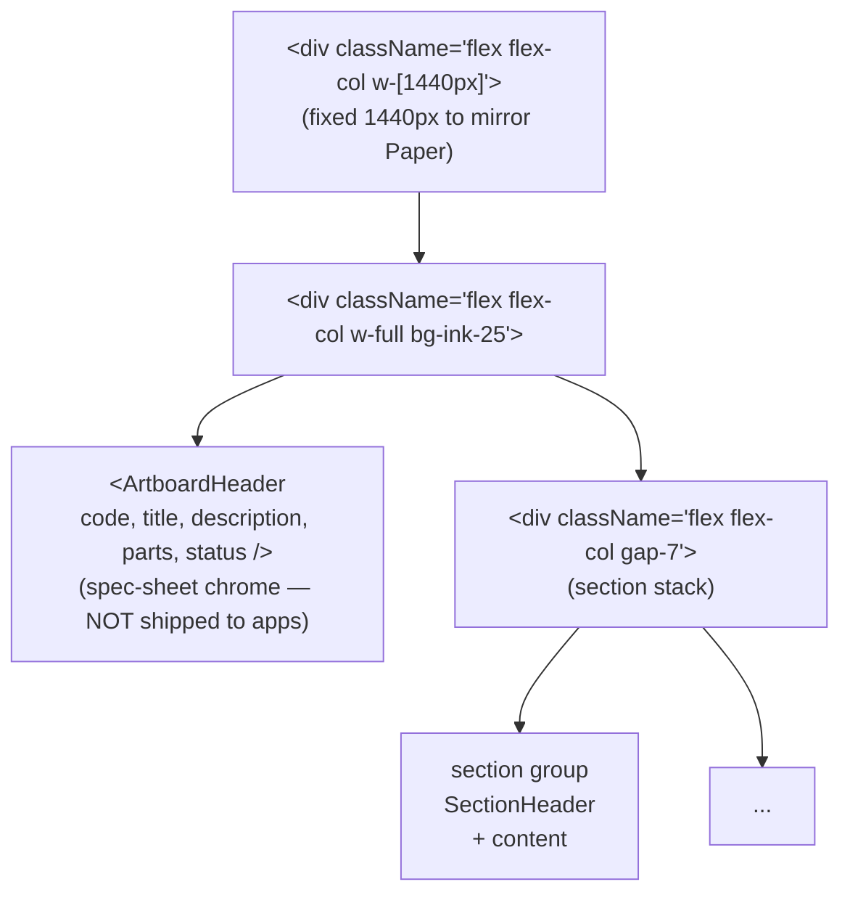
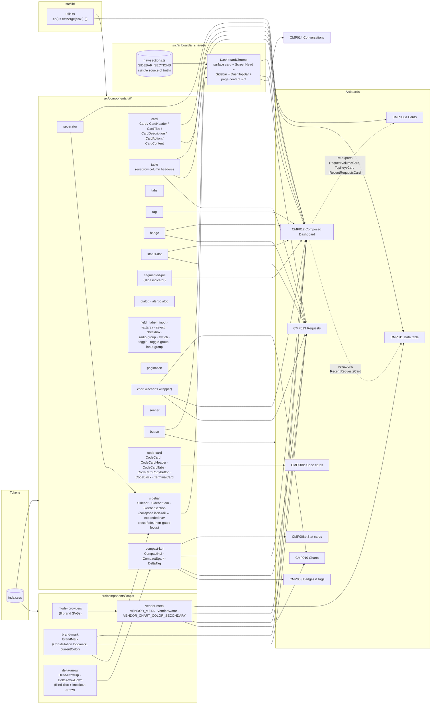
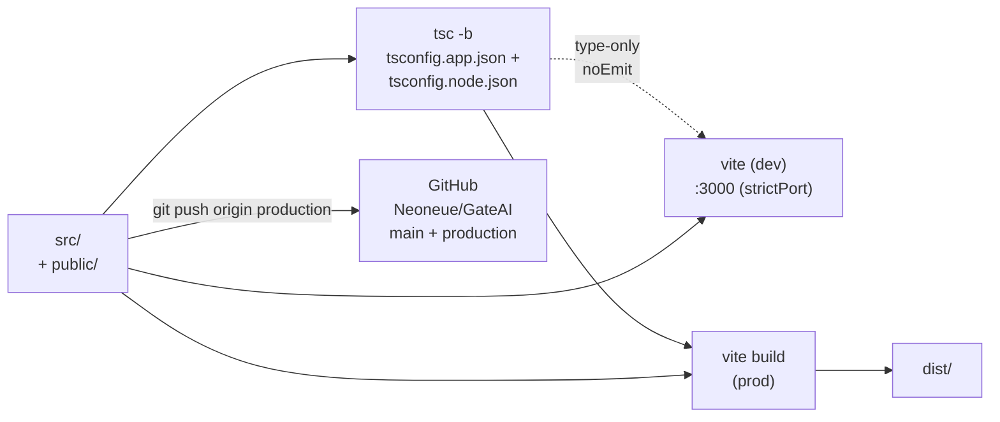

# Data Model — Constellation Gate AI Design System

> **Scope:** architecture map for this repo (`mvp` / *Constellation Gate AI* / GitHub `Neoneue/GateAI`). Six Mermaid diagrams: stack, app shell, artboard pattern, contract chain, primitive reuse graph, Paper-to-code flow. Update when the project's structure or contract chain changes.

> **Ship boundary:** `src/` is the product. `front-end-developer/` is a vendored design-methodology agent (gitignored) — it ships nothing into the build. `.claude/agents/front-end-developer.md` is the registered subagent that enforces design craft on dispatches.

---

## Mission

A design-system showcase translated section-by-section from a Paper file (*Brilliant quartz*, artboard `v8 Geist-rounded · Showcase`, 1536×12674px). Each `§ CMP-###` block in Paper becomes one React **artboard** page that demonstrates one or more reusable primitives. The build is the catalog *and* the live primitive library — every visible thing on every artboard must trace back to a primitive in `src/components/ui/` or `src/components/icons/`.

Single source of truth for: chart cards, metric cards, KPI tiles, sparklines, status pills, segmented controls, model provider chips, code cards, tables, dashboard composition. Each primitive lives once; artboards consume by import; the dashboard surface (CMP-012) imports from the same primitives the catalog artboards demonstrate.

### Three core principles

1. **Reuse before extract before invent.** If a primitive exists in `src/components/ui/`, use it. If a pattern recurs across 2+ surfaces, extract it. Inline reimplementation is the failure mode.
2. **Tokens, never hex.** Every color/spacing/radius/type choice traces to `src/index.css` `@theme` (or `vendor-meta.tsx` brand colors for external vendors). No raw hex, no orphan `oklch(...)` literals in artboard JSX. Type sizes only from Tailwind's named scale (`text-xs`/`sm`/`base`/…/`6xl`); never `text-[Npx]`.
3. **Composed surfaces are arrange-and-wire only.** CMP-012 (Composed Dashboard) ships zero new visual primitives; it imports `RequestVolumeCard`, `TopKeysCard`, `CompactKpi`, `Table`, `Button`, `VendorAvatar`, `Card`, `Tag`, `StatusDot` and arranges them.

---

## 1. Stack



- `npm run dev` → Vite on **port 3000** (user preference; not the 5173 default). Use `npm run dev -- --port 3000 --strictPort`.
- `npm run build` → `tsc -b && vite build`.
- `npm run lint` → `eslint .`.

---

## 2. App shell — `App.tsx` + `main.tsx`

The app has **no router**. Page switching is `useState` over a flat `NAV` array. The active page is rendered into a centered scroll container.

The CMP-012/013/014 surfaces share their **production-shell chrome** via `_shared/DashboardChrome.tsx` (outer card + ScreenHead + topbar) and the `Sidebar` primitive at `components/ui/sidebar.tsx` (collapsed-rail / expanded-nav cross-fade). The single source of truth for sidebar nav data is `_shared/nav-sections.ts` (`SIDEBAR_SECTIONS`). Inner-sidebar collapse state lives in App-level `useState` and is forwarded to each artboard via `innerSidebarExpanded` / `onToggleInnerSidebar` props so the toggle persists across page swaps.



`PageId` is a string union of `'cmp-000' | 'cmp-001' | ... | 'cmp-008a' | 'cmp-008b' | 'cmp-008c' | 'cmp-009' | ... | 'cmp-012' | 'cmp-013' | 'cmp-014'`. `NavItem` is a discriminated union supporting `{ kind: 'page', id, code, name, Component }` and (optional) `{ kind: 'group', label }` separators. The NAV-rendering branches on `kind`; group entries render as a non-clickable eyebrow label.

The shell also has a **collapse toggle** (added 2026-05-05): the sidebar slides closed via `width 240→0` transition; a fixed-position `PanelLeftOpen` button at top-left brings it back. Lets operators view artboards full-bleed.

---

## 3. Artboard pattern — every `CMP*` page is the same shape



**Every artboard:**

- File `src/artboards/CMP{NNN}{PascalName}.tsx`, named export matching filename
- Outer `<div className="flex flex-col w-[1440px]">`
- `<ArtboardHeader code={"CMP-XXX"} title=... description=... parts=... />` from `_shared/ArtboardHeader.tsx`
- One or more `<SectionHeader code={"CMP-XXX.N — TITLE"} hint=... />` blocks delimiting sub-sections
- Content composed entirely from primitives in `src/components/ui/` (or extracted helpers)
- Registered in `src/App.tsx` `NAV[]` (and `PageId` union extended)

Production-shell artboards (CMP-012/013/014) additionally wrap their page content in `<DashboardChrome ... activeNavId="..." sidebarExpanded={...} onToggleSidebar={...}>{children}</DashboardChrome>` from `_shared/DashboardChrome.tsx`, which renders the screen head, the `<Sidebar>` primitive, and the breadcrumb topbar. The artboard file owns only the page-internal pieces (PageHeader, KPI rail, tables, etc.).

Section list (current build):

| Code | File | Purpose |
|---|---|---|
| CMP-000 | `CMP000Typography.tsx` | Type scale (15 specimens) + mono-vs-sans |
| CMP-001 | `CMP001Colors.tsx` | Palette spec sheet — ink + blue ramps, semantic tokens, syntax tokens, vendor brand exception |
| CMP-002 | `CMP002Buttons.tsx` | Button variants × sizes × states |
| CMP-003 | `CMP003BadgesAndTags.tsx` | Status pills, counters, chips |
| CMP-004 | `CMP004FormFields.tsx` | Input, textarea, select, check, radio, switch |
| CMP-005 | `CMP005FilterBar.tsx` | Search + chip filters + dropdowns |
| CMP-006 | `CMP006TabsPagination.tsx` | Underline tabs, segmented, pagination |
| CMP-007 | `CMP007ModalEmptyState.tsx` | Modal (incl. CMP-007.1b Generation details) + empty state |
| CMP-008a | `CMP008aCards.tsx` | Card chrome (chart card + metric/list card) |
| CMP-008b | `CMP008bStatCards.tsx` | Stat cards (compact, flat, stat row, compare, status) |
| CMP-008c | `CMP008cCodeCards.tsx` | Code cards (5 layouts: hero / tabs / terminal / req-resp / steps) |
| CMP-009 | `CMP009Toast.tsx` | Sonner toast deck |
| CMP-010 | `CMP010Charts.tsx` | Spend trend (line+area), Cost by model (stacked) |
| CMP-011 | `CMP011DataTable.tsx` | Three table treatments: sortable list (1), activity feed (2 — re-uses RecentRequestsCard), drill-down panel with severity scoring (3) |
| CMP-012 | `CMP012ComposedDashboard.tsx` | Production-shell Overview surface — 4-card consolidated KPI rail, RequestVolume + TopKeys row, RecentRequests table, Quick Actions section |
| CMP-013 | `CMP013Requests.tsx` | Requests / Observability surface — hero metric card with oscillating activity chart, sortable request table with row-click drill-in modal (Summary / Messages / Security / Audit tabs) |
| CMP-014 | `CMP014Conversations.tsx` | Conversations surface — KPI rail (Active Now / Conversations / Avg Turns / Avg Cost) + filtered conversations table grouped by `cnv_*` id, linkified row titles, multi-vendor model column. Row click opens `ConversationDetailDialog` — twin-panel Dialog modal (Messages LEFT, Request Trace RIGHT) with cross-link selection state shared between panels (2026-05-07) |

---

## 4. Token contract chain

```mermaid
graph LR
    INDEX[("src/index.css<br/>@theme {} — 5 OKLCH ramps<br/>--color-ink-50..950 (neutral, chroma 0)<br/>--color-blue-50..950 (700 = brand mark<br/>oklch(0.345 0.224 268.85) ≈ #1F2FCE)<br/>--color-success-50..950 (Tailwind v4 green)<br/>--color-warning-50..950 (Tailwind v4 amber)<br/>--color-danger-50..950 (Tailwind v4 red)<br/>--color-white · --color-canvas (#ECECE7)<br/>--color-syntax-* · --color-traffic-*<br/>--shadow-border · --shadow-popup · --shadow-modal<br/>--text-3xl/4xl/6xl (Geist values 32/40/64)")]
    CSSVARS[":root vars<br/>--background = white<br/>--foreground = ink-900<br/>--primary = ink-900 (NOT blue)<br/>--secondary/muted/accent = ink-100<br/>--muted-foreground = ink-500<br/>--destructive = danger-600<br/>--border/input = ink-200<br/>--ring = ink-400<br/>--chart-1..8 = categorical OKLCH palette<br/>(brand-decoupled, see §Chart palette)<br/>--radius = 0.625rem (10px base)"]
    THEMEINLINE["@theme inline<br/>maps :root vars to<br/>Tailwind color/radius utilities<br/>--radius-xl OVERRIDDEN to 12px<br/>(Geist modal-tier)"]
    TWUTILS["Tailwind utilities<br/>bg-ink-{50..950} text-ink-{50..950}<br/>bg-blue-* bg-success-* bg-warning-* bg-danger-*<br/>text-primary bg-card border-border<br/>rounded-sm (6) rounded-xl (12) rounded-xs (4)<br/>shadow-(--shadow-border) etc."]
    PRIMS["src/components/ui/*<br/>className strings<br/>(no hex / oklch literals here)"]
    ARTS["src/artboards/CMP*<br/>className strings<br/>(no hex / oklch literals here)"]
    VENDOR[("src/components/icons/<br/>vendor-meta.tsx<br/>VENDOR_META.color (brand)<br/>used by VendorAvatar icon only<br/>(charts use --chart-* palette)")]

    INDEX --> CSSVARS
    INDEX --> THEMEINLINE
    THEMEINLINE --> TWUTILS
    CSSVARS --> THEMEINLINE
    TWUTILS --> PRIMS
    TWUTILS --> ARTS
    VENDOR -.->|brand-hex exception<br/>(VendorAvatar icons only;<br/>charts use --chart-*)| ARTS
```

**Authority:** `system.md` (host-level Theme + Project) > `front-end-developer/contract/globals.md` (Layer 1) > `src/index.css` (this repo's globals) + `docs/brand-guidelines.md` (project-side synthesis of decisions in code). Currently `system.md` does not exist; `index.css` is the operative token source. `vendor-meta.tsx` is the only place raw brand hex literals live (intentional — external brand identities).

**Color system (rewritten 2026-05-05, OKLCH migration):** Five 11-step ramps (50/100/200/300/400/500/600/700/800/900/950), all OKLCH, Tailwind-aligned naming. Step roles are stable across ramps:
- **50–100** subtle backgrounds (washes, hover-bg)
- **200** borders, dividers
- **300** strong borders, ghost-button hover-bg
- **400** placeholder text, low-contrast accents
- **500** secondary text, chart strokes (medium contrast)
- **600** saturated mid (default solid surfaces, primary action color for non-ink)
- **700** saturated dark (hover state for solids, primary text on tinted bg)
- **800–900** text on white (high-contrast)
- **950** deepest (rare — extreme contrast, dark-mode anchors)

`info` aliases to blue (no separate ramp). Single-token semantics (`text-warning`, `bg-success`, `-2` brighter variants) **were removed** during the migration — force step choice at the call site. Rationale + audit trail in memory file `feedback_color-system-oklch.md`.

**Hard rule (still in force):** **no raw hex / oklch / rgba values outside palette atoms in `@theme`.** Every semantic token in `:root` references a palette atom via `var(--color-*)`. Shadow tokens use `color-mix(in oklch, var(--color-ink-800) X%, transparent)` so the shadow family tracks the ink ramp. SVG presentation attributes (`fill="..."` / `stroke="..."` in TSX) accept `var(--color-*)` directly. **No dark mode shipped** — `:root.dark` block is intentionally absent; `@custom-variant dark` is declared in `index.css` for future activation.

**Primary action color:** `--color-primary` and `--primary` resolve to `var(--color-ink-900)` — the project's primary action color is **dark ink, not blue**. Blue is the brand-accent palette only (mark, focus rings, info-state badges, completed-state badges, active-tab indicator).

**Material ladder (codified 2026-05-05, Geist alignment):** Two-tier elevation system:
- **Everyday surfaces** — 6px radius (`rounded-sm`) + `shadow-(--shadow-border)` (1px ink-800/6% ring + subtle ambient lift). Cards, inputs, buttons, badges, KPI cards, table containers.
- **Modal surfaces** — 12px radius (`rounded-xl` overridden in `@theme inline` to `0.75rem`) + `shadow-(--shadow-modal)`. Dialog, AlertDialog.
- **Sub-elements inside tracks** — 4px (`rounded-xs`). Tabs trigger/indicator, Segmented item/indicator, SelectItem. Item radius < container radius (concentric rule).

**Voice split (codified 2026-05-05):** four typographic voices, each with one job — mono uppercase = section eyebrow; sans Title Case = field/column label; mono normal = ID/value; sans body = content. Sans labels are `font-medium` minimum.

**Vendor color model (revised 2026-05-06):** the `VENDOR_META[vendor].color` field is the brand-hex token. Used by `<VendorAvatar />` (icon rendering) and any other surface that needs to identify a vendor by color. **NOT used by chart series anymore** — charts use the standalone `--chart-*` categorical palette (see Chart palette section below); per PM call: "we need a palette of colors for all graphs throughout the app and they should be used regardless of the content."

**`<VendorAvatar />` treatment (revised 2026-05-06, iteration 7):** Bare brand-colored icon at `size-4`, no chip wrapper. SVGs use `fill="currentColor"`, so setting `style={{ color: meta.color }}` on the icon paints the glyph in the brand hex. Three vendors render multi-color via per-path fills inside their SVG (Cohere three-blob, Mistral five-band gradient, Gemini canonical layered gradients) — for these, the wrapper's `style.color` is ignored. Iteration history is captured in the `vendor-meta.tsx` file comment so this doesn't re-prosecute. Don't revert to a chip wrapper without explicit ask.

**Chart palette (codified 2026-05-06):** Standalone 8-slot categorical OKLCH palette in `--chart-1..8` (`src/index.css`, exposed as `--color-chart-1..8` Tailwind utilities). Brand-decoupled — chart series pick a slot **by index** in stable order, regardless of what each series represents. Final values:

| Slot | OKLCH | Hue family |
|---|---|---|
| 1 | `oklch(0.62 0.18 255)` | blue |
| 2 | `oklch(0.72 0.17 50)` | orange |
| 3 | `oklch(0.72 0.20 145)` | green |
| 4 | `oklch(0.70 0.18 290)` | purple |
| 5 | `oklch(0.65 0.20 18)` | coral |
| 6 | `oklch(0.75 0.13 195)` | teal |
| 7 | `oklch(0.85 0.16 88)` | amber |
| 8 | `oklch(0.68 0.20 335)` | magenta |

All eight slots sit at L 0.62–0.85, C 0.13–0.20 (uniformly bright, mid-saturation). Hue distribution covers all six color families; adjacent slots in palette order are ≥85° apart in hue. **No neutrals as categorical slots** — Tableau and D3 only use gray as a slot 9+ extender; an 8-slot palette uses vivid colors throughout (per IBM Carbon, Atlassian categorical8 conventions). The reasoning, full survey, and iteration history are documented in `docs/chart-colors.md`.

Per-series `slot?: number` override on the series type lets specific charts pin colors to specific slots when there's a brand mnemonic worth honoring (Anthropic series → orange slot 2, OpenAI series → blue slot 1). Default is positional; opt into mnemonic only when series ARE entities readers have prior color associations with. Don't repeat slots within a single legend.

**KPI rail sparklines** also use the chart palette tokens (`--color-chart-1` blue, `--color-chart-3` green, `--color-chart-7` amber, `--color-ink-500` for the neutral first slot). Earlier they used semantic ramps (success-500 / warning-500 / blue-500), which mixed coloring systems and made the rail read inconsistently — semantic-by-some-measure for some metrics, neutral for others.

**Link affordance (codified 2026-05-05):** Inline links use **permanent faint underline + ink color** (no blue link tokens). Recipe: `underline decoration-ink-200 underline-offset-2 hover:decoration-ink-500 focus-visible:decoration-ink-500 outline-none`. Text color stays in the ink ramp matching the surface (typically `text-ink-900` for primary content, `text-ink-700` for secondary inside ink-500 meta lines). Blue is reserved for info/completed/active-tab/focus — adding "link" to that overload was rejected after research. See `feedback_link-affordance.md`.

**Subtitle width policy (codified 2026-05-06):** Page-header description text caps at `max-w-1/2` of the page (50% of the page-header flex parent). Applied to the **wrapper column** (the `flex flex-col` containing both `<h1>` and `<p>`), not directly to the `<p>` — fractional max-w on a leaf inside a content-sized column won't behave as expected.

**Table ink-density tiers (codified 2026-05-06, PM-flagged):** Body cells in composed-surface tables (CMP-012/013/014) use **three ink tiers only** — no `ink-600` or `ink-700` middle tones. PM caught a perceptual drift between `ink-600` IDs and `ink-800` numerics (~15-pt OKLCH lightness gap, very visible).

| Tier | Role | Token |
|---|---|---|
| 500 | Context — timestamps, sub-IDs sitting under a primary identifier | `text-ink-500` |
| 800 | Body data — IDs, keys, numerics, initiators, secondary text | `text-ink-800` |
| 900 | Primary identifier — model name, row title button | `text-ink-900` |

Plus `ink-400` reserved for missing-data dashes (`—`) so they read as semantically empty. Badges/pills handle their own color and are exempt. Industry-aligned (Material / Carbon / Atlassian / Polaris / Vercel Geist all run three-tier). See `feedback_table-ink-tiers.md`.

**Numeric column alignment (codified 2026-05-06):** Numeric columns in composed-surface tables right-align via `text-right` on TableHead + TableCell. `tabular-nums` alone only fixes intra-row digit width — it does not fix inter-row drift when `4,051` sits above `52,810`. Right-edge anchoring places the ones-place at a fixed x across rows so magnitudes compare at a glance. CMP-013's earlier left-align comment ("CMP-011 convention — `tabular-nums` makes left-align OK") was wrong reasoning and has been rewritten.

**Latency icon-slot pattern (CMP-013 specific):** When a numeric column carries a conditional row-state indicator (e.g. slow-row TriangleAlert in the Latency column), every row reserves a fixed-width icon slot in the **leading** position (icon-then-value reading order). Slow rows render the icon; non-slow rows render an invisible `size-3` placeholder. `inline-flex justify-end` inside a `text-right` cell pins the assembly to the cell's right edge so digit columns stay anchored regardless of row state. Don't trail the icon after the value — that breaks alignment.

---

## 5. Primitive reuse graph (the load-bearing one)

This is the diagram that proves *every artboard composes from primitives*. Arrows mean "imports from."



**Key reuse loops to call out:**

- **`CompactKpi` + `DeltaTag` + `CompactSpark`** live in `src/components/ui/compact-kpi.tsx`. Consumed by `CMP-003` (delta tag spec sheet), `CMP-008b` (Stat cards), `CMP-012` (KPI rail), `CMP-013` (hero card), `CMP-014` (KPI rail). Title style (`font-mono font-medium uppercase tracking-[0.1em] text-xs text-ink-500`) is canonical Eyebrow / sm. **DeltaTag** (final treatment 2026-05-05, arrow direction corrected 2026-05-06, rate-vs-volume rule codified 2026-05-06): bare directional arrow (Lucide `ArrowUpRight` / `ArrowDownRight`) + value in mono — NO pill chip, NO wash background. Both arrows move forward in time (rightward); only the vertical direction differs by sign. Default coloring is sign-based: positive = `text-success-700` + up arrow, negative = `text-destructive` + down arrow. The `inverted` prop (passed through from CompactKpi's `deltaInverted`) flips the tone — positive paints red, negative paints green. Direction arrow still tracks the literal sign — only the color flips. No textual qualifier accompanies the inverted color (a "Lower is better" sub-line was tried 2026-05-06 and rejected as bad UI).

**Rate-vs-volume rule for `deltaInverted`:** `deltaInverted` only applies to **rate metrics where lower is unambiguously better** — latency, error rate, cost-per-call, cost-per-conversation, time-to-first-token. **Volume metrics stay sign-based** even when they're cost-flavored — Total Cost rising correlates with usage growth (which is what you want for a usage-based product), so it's not unambiguously bad and shouldn't paint red. Total Errors as a count is similar — could mean more traffic. Use `deltaInverted` only when "down is good" is true regardless of context.

Active inverted call sites today: CMP-012 Avg Latency, CMP-014 Avg Cost / Conv. Total Cost is intentionally NOT inverted. Color via plain `text-success-700` / `text-destructive` on inline-flex span. Strips leading `+`/`-` since icon carries direction. **CompactSpark** defaults `endDot = true` (flipped 2026-05-06) so trailing dot is consistent across all KPI rails.
- **`Card` family** lives in `src/components/ui/card.tsx`. Card primitive uses `shadow-(--shadow-border)` (layered ring + ambient lift), no hard border — refactored 2026-05-06 from the previous `border + shadow-xs` pattern. `RequestVolumeCard`, `TopKeysCard`, `RecentRequestsCard` (defined in `CMP012ComposedDashboard.tsx`, **exported** for reuse) are consumed by `CMP-008a`, `CMP-011`, and `CMP-012`. Single source of truth.
- **`VendorAvatar` + `VENDOR_META`** lives in `src/components/icons/vendor-meta.tsx`. Consumed by CMP-007, CMP-010, CMP-011, CMP-012, CMP-013, CMP-014. The `color` field is single-source. **Final treatment (locked 2026-05-05 after 4 iterations):** white provider glyph on saturated brand-color chip, **no `tone` prop**. Used everywhere identically — tables, KPI cards, modal headers, top-key lists. Trade-off accepted: vendor-stacked tables read as a multi-hue column, but cross-surface consistency wins. **DO NOT reintroduce `tone` prop** without explicit ask (`feedback_vendor-avatar-treatment.md`).
- **`BrandMark`** (added 2026-05-05) — Constellation Gate AI logomark in `src/components/icons/brand-mark.tsx`. 7-path constellation SVG with `fill="currentColor"`. Consumed by CMP-012, CMP-013, CMP-014 left rails (`<BrandMark className="size-8 text-blue-700" />`). Static asset at `public/logomark.svg`. `--color-blue-700` is anchored to the logomark's brand color via OKLCH (`oklch(0.345 0.224 268.85)` ≈ `#1F2FCE`).
- **`Table` primitive** column header: sans Title Case `font-medium text-ink-500` (lifted from ink-600 on 2026-05-05 so heads sit a step quieter than body values). Mono is reserved for ID/value body cells. Body numerics use `font-mono tabular-nums text-ink-800`. Clickable `<TableRow>` (CMP-013/014) gets `hover:bg-ink-50 transition-colors duration-150 ease-out` — added 2026-05-06 polish pass.
- **Selector primitives with sliding indicators:** `Tabs` default variant, `Segmented` pill variant, and `SegmentedPill` all use a sliding white indicator on selection. `Tabs` uses Base UI's built-in `<TabsPrimitive.Indicator />` driven by `--active-tab-{left,top,width,height}` CSS vars. Item radius is `rounded-xs` (4px) inside `rounded-sm` (6px) tracks, per the concentric rule.
- **Code card primitives** (`CodeCard`, `TerminalCard`, `CodeBlock`) live in `code-card.tsx`. CMP-008c is the only consumer today.
- **Consolidated row pattern**: single bordered card with internal sections divided by `before:` pseudo-element hairlines at `inset-y-4`. Used by CMP-012's KPI rail (4 cards consolidated into one row) and Quick Actions card. The accent treatment on a focal section uses `bg-blue-50`.
- **`ArtboardHeader` + `SectionHeader`** live in `_shared/ArtboardHeader.tsx`. Refactored 2026-05-05 to a three-step heading hierarchy:
  - Artboard `<h1>`: `text-3xl/9` (32px) sans-medium ink-800 — propagates to all artboards
  - Section `<h2>`: `text-2xl/8` (24px) sans-medium ink-800, **with mono-uppercase eyebrow above** parsing the `code` prop on " — " separator (e.g., `CMP-000.1 — SCALE` renders as small mono `CMP-000.1` then large h2 `SCALE`)
  - Card titles: 16–20px (text-base / text-xl)
  Each step a meaningful drop. Called via `<SectionHeader code="CMP-XXX.N — TITLE" hint="…" />` from every artboard's section markers.
- **Sidebar toggle icon cross-fade** (added 2026-05-06) in CMP-012/013/014 PageHeader/topbar — `PanelLeftClose` ↔ `PanelLeftOpen` swap is no longer an instant React conditional. Both icons live in DOM, absolute-positioned over each other, cross-fading on toggle: `scale 0.25 → 1`, `opacity 0 → 1`, `blur 4px → 0`, `cubic-bezier(0.2, 0, 0, 1)`, 300ms. `motion-reduce:transition-none` for accessibility.
- **`MessageBlock`** (added 2026-05-07) lives in `src/components/ui/message-block.tsx`. Single primitive for one conversation/request turn (`role: system | user | tool | assistant`). Outline-only by default — earlier tone-tinted bubble fills (`bg-ink-100` / `bg-blue-50` washes) read as a chat-app aesthetic and were rejected; assistant gets a `border-blue-100` to separate model output from user/tool input but no fill. Optional props: `time` (right-aligned timestamp on metadata line), `requestId` (rendered below the bubble with `↳` corner glyph), `selected` (paints a blue ring around the bubble for the cross-link interaction — warn-tone selection rings in `warning-500` instead so warn data state survives the selection layer), `onClick` (bubble becomes a `<button>` when present), `tone: 'default' | 'warn'` (the warn tone capability is preserved on the primitive but is currently unused — CMP-014 deliberately does NOT pass `tone='warn'` because the warn signal lives narrowly on the `pep` badge inside the body and the warnNote in the trace, not as a bubble wash). Voice split: role label is sans Title Case, tool function name is mono lowercase. Consumed by CMP-013's `RequestDetailSheet` and CMP-014's `ConversationDetailDialog` — the two surfaces that show conversation/trace threads.
- **`HeroNumeric`** (codified 2026-05-07) lives in `src/components/ui/hero-numeric.tsx`. Single source of truth for the sans-tabular hero summary numeric tier (≥24px). Two sizes: `default` (text-2xl/8 = 24px, used by `CompactKpi` value + Top Keys hero) and `lg` (text-3xl/9 = 32px, used by full-page hero metrics like CMP-013's `8,241`). Recipe: `font-sans font-medium tabular-nums tracking-tight text-ink-900`. **Don't hand-roll the recipe** — every hero summary numeric should consume the primitive so the typographic tier stays single-sourced. Below ~20px numerics revert to mono regardless of role (modal KpiTile at text-lg, table cells, badge contents, IDs).
- **`TablePaginationFooter`** (codified 2026-05-07) lives in `src/components/ui/table-pagination-footer.tsx`. Encapsulates count summary + rows-per-page select + windowed page links (truncation via the exported `buildPageWindow` helper). Controlled — page + rowsPerPage state stays in the parent. Used by CMP-011 sortable, CMP-013 requests, CMP-014 conversations. Don't hand-roll pagination footers; extend the primitive (new prop, new variant) if behavior diverges.
- **Twin-panel Dialog modal pattern (codified 2026-05-07, CMP-014's `ConversationDetailDialog`):** when two paired data structures need to be visible simultaneously with cross-link selection (messages ↔ request trace, both keyed off `requestId`), use a Dialog modal — NOT a Sheet. The Sheet pattern hides the counterpart panel behind a tab switch, breaking the cross-link UX (click a message, lose sight of the matching trace event). Dialog at `sm:max-w-5xl max-h-[90vh] gap-0 p-0 overflow-hidden flex flex-col` keeps both panels visible at lg+, stacks at narrow widths (`grid-cols-1 lg:grid-cols-2`). Selection state (`activeRequestId: string | null`) lives in the Dialog body and is shared with both panels; clicking either side sets it, both panels paint the matching item, and `useEffect` + `data-request-id={requestId}` + `scrollIntoView({ block: 'nearest', behavior: 'smooth' })` auto-scrolls the counterpart into view if it's outside the visible scroll. Selection treatment: blue ring on the message bubble + `bg-blue-50` row wash + opacity-transitioned blue left-bar on the trace row (always in DOM, opacity-0/100 toggles so the bar fades with the wash instead of popping in).
- **Per-row timeline track segments (codified 2026-05-07, `TraceItem`):** vertical timeline tracks in scroll-overflowing surfaces should render as per-row segments inside each row, NOT as a single absolute line in the parent. A single `absolute inset-y-X` line inside an `overflow-y-auto` container sizes against the *viewport*, not the content — it gets cut off whenever the trace overflows. Per-row segments (`isFirst`/`isLast` props on the row) compose correctly under any content height: first row = `top-6 bottom-0` (line starts at node center, runs to row bottom), last row = `top-0 h-6` (runs from row top to node center), middle rows = `inset-y-0` (full row height). Node `bg-white` masks the line where it crosses; DOM order puts the segment first so the node renders above it. The track x-position derives from the row layout (`pl-3 + node-half = 24px` from the row's padding box left, so a 2px line centers at `left-[23px]`).
- **Observability vs conversation modeling:** the `MessageBlock` flat-list (system/user/tool/assistant as discrete roles) follows the OpenAI Chat Completions convention, NOT the Anthropic Messages convention (which nests `tool_use` / `tool_result` blocks inside assistant/user messages). The flat list is correct for *observability* surfaces where the unit of measurement is the gateway request — every billable, latency-tracked event maps 1:1 to a trace row. Nesting tool calls inside assistant turns would break the message↔trace cardinality and the cross-link contract. For a *conversation* surface (e.g. an agent-customer chat product), nesting would be correct. CMP-013/014 are observability surfaces — flat list is right.
- **`PaginationLink` renders as `<button type="button">`** (codified 2026-05-06) in `src/components/ui/pagination.tsx`. Original shadcn primitive used Base UI's `nativeButton={false}` + `render={<a>}` to force anchor rendering — wrong for this codebase, which has no router. Cmd/middle-click on pagination was never going anywhere. Type changed from `ComponentProps<"a">` to `ComponentProps<"button">`; `aria-current` / `data-slot` / `data-active` land on the button directly. Call sites (CMP-013, CMP-014) drop dead `e.preventDefault()` and `href="#"` — the onClick handler is now the actual action. **Inline anchors in composed surfaces (modal subtitle conversation refs, row-title links) follow the same conversion** — `<a href="#" onClick={preventDefault}>` is replaced by `<button type="button">` styled with the link affordance (ink + permanent faint underline). Visual contract preserved; semantics corrected.

---

## 6. Paper → Code flow

```mermaid
sequenceDiagram
    participant U as User
    participant M as Main thread
    participant A as front-end-developer agent
    participant P as Paper MCP
    participant FS as src/artboards/

    U->>M: "Add CMP-XYZ"
    M->>P: get_basic_info, get_tree_summary({nodeId, depth})
    M->>A: dispatch with nodeId, target file path,<br/>existing primitives to reuse
    A->>P: get_screenshot({nodeId, scale: 2}) (visual reference)
    A->>P: get_jsx({nodeId, format: 'tailwind'}) (production code)
    A->>P: get_computed_styles (precision values)
    A->>FS: Write CMPxyz.tsx<br/>- Wrap in &lt;div w-[1440px]&gt;<br/>- ArtboardHeader + SectionHeaders<br/>- Reuse src/components/ui/*<br/>- Adapt to vendor-meta if vendor data
    A->>FS: Update src/App.tsx (NAV + PageId)
    A->>FS: tsc + dev-server screenshot verify
    A->>M: deliverable (file paths, decisions, drift)
    M->>U: confirm done
```

**Source-data rule:** the agent ALWAYS calls `get_jsx(format="tailwind")` + `get_computed_styles` on the source node. Screenshots are for visual verification only, never for tracing values. Paper's JSX output IS production HTML/CSS; the agent's job is adaptation (named export, project imports, primitive swaps, vendor mapping).

---

## 7. Build / dev pipeline



**Branches:**
- `main` — stable line; merge target when production is ready to ship
- `production` — working branch; commits land here first

**Dev-server lifecycle:** main thread responsibility (per CLAUDE.md exception). The orchestrated agent never restarts it.

---

## 8. File tree (current)

```text
mvp/
├── CLAUDE.md                       ← orchestration rules + repo conventions
├── data-model.md                   ← this file
├── README.md                       ← Vite default README (untouched)
├── components.json                 ← shadcn config (style: base-nova)
├── package.json                    ← deps + scripts
├── vite.config.ts                  ← @ alias + plugins
├── tsconfig.{json,app,node}.json
├── eslint.config.js
├── index.html
├── docs/
│   └── brand-guidelines.md         ← project-side synthesis of brand decisions in code
├── public/
│   ├── favicon.svg
│   ├── icons.svg
│   └── logomark.svg                ← Constellation Gate AI logomark (added 2026-05-05)
├── .claude/
│   ├── agents/front-end-developer.md   ← project-scoped subagent (committed)
│   └── settings.local.json             ← gitignored
├── front-end-developer/            ← gitignored vendored agent bundle
│   ├── agent/front-end-developer.md
│   ├── contract/globals.md
│   ├── data-model.md (the agent's own)
│   ├── knowledge/{core,figma,paper,shadcn}/
│   ├── skills/<33 skills>/
│   └── hooks/<5 .sh>/
└── src/
    ├── main.tsx                    ← StrictMode root
    ├── App.tsx                     ← left nav + page swap, sidebar collapse toggle (2026-05-05)
    ├── index.css                   ← Tailwind v4 imports + @theme tokens
    ├── App.css                     ← (legacy, mostly empty)
    ├── artboards/
    │   ├── _shared/
    │   │   ├── ArtboardHeader.tsx
    │   │   ├── DashboardChrome.tsx     ← surface card + ScreenHead + Sidebar + DashTopBar (CMP-012/013/014)
    │   │   └── nav-sections.ts         ← SIDEBAR_SECTIONS — single source of truth for production-shell nav
    │   ├── CMP000Typography.tsx
    │   ├── CMP001Colors.tsx
    │   ├── CMP002Buttons.tsx
    │   ├── CMP003BadgesAndTags.tsx     ← + CMP-003.3 DeltaTag specimen (2026-05-05)
    │   ├── CMP004FormFields.tsx
    │   ├── CMP005FilterBar.tsx
    │   ├── CMP006TabsPagination.tsx
    │   ├── CMP007ModalEmptyState.tsx
    │   ├── CMP008aCards.tsx
    │   ├── CMP008bStatCards.tsx
    │   ├── CMP008cCodeCards.tsx
    │   ├── CMP009Toast.tsx
    │   ├── CMP010Charts.tsx
    │   ├── CMP011DataTable.tsx          ← three layouts (sortable / activity / drill-down)
    │   ├── CMP012ComposedDashboard.tsx  ← consolidated KPI rail + Quick Actions section
    │   ├── CMP013Requests.tsx           ← Requests / Observability surface
    │   └── CMP014Conversations.tsx      ← Conversations surface — KPI rail + filtered table (2026-05-05)
    ├── components/
    │   ├── canvas/Artboard.tsx     ← absolute-positioned wrapper (zoomable canvas mode; not used by current shell)
    │   ├── icons/
    │   │   ├── model-providers.tsx ← Anthropic/OpenAI/Gemini/Grok/Meta/Mistral/DeepSeek/Cohere SVGs
    │   │   ├── vendor-meta.tsx     ← Vendor type + VENDOR_META + VendorAvatar (single brand-chip treatment)
    │   │   └── brand-mark.tsx      ← Constellation logomark (currentColor)
    │   └── ui/                     ← 32+ shadcn/Base UI primitives (incl. sidebar.tsx — production-shell nav primitive, message-block.tsx, hero-numeric.tsx, table-pagination-footer.tsx — all 2026-05-07)
    ├── lib/
    │   ├── utils.ts                ← cn() helper
    │   └── portal-target.tsx
    └── assets/                     ← hero.png, react.svg, vite.svg
```

---

## 9. Cross-references

- **Token decisions:** `src/index.css` (open this when adding/auditing colors)
- **Brand guidelines (human-readable):** `docs/brand-guidelines.md` (color palette, typography, voice, logo, voice split, layout grid, component conventions — synthesizes what's in code)
- **Repo conventions + dispatch rules:** `CLAUDE.md`
- **Design methodology contract:** `.claude/agents/front-end-developer.md` (sourced from `front-end-developer/agent/front-end-developer.md`)
- **Agent skill routing:** `front-end-developer/agent/front-end-developer.md` (skill table near the top)
- **Paper canvas reference:** the Paper file *Brilliant quartz* (`app.paper.design/file/01KQ33WPFNCEZAER8FDFPVW5EP`)
- **Session decision logs (most recent first):**
  - `~/.claude/projects/-Users-cponticas-Documents-GitHub-mvp/memory/2026-05-07-session-modal-craft.md` — ConversationDetailDialog (Sheet→Dialog migration, twin panel, cross-link selection, auto-scroll-into-view) + warn-narrowing (no row/bubble wash) + per-row timeline track segments + MessageBlock primitive + HeroNumeric primitive + TablePaginationFooter primitive + Badge mono default + asymmetric SelectTrigger padding + rams + impeccable reviews
  - `~/.claude/projects/-Users-cponticas-Documents-GitHub-mvp/memory/2026-05-06-session-audit-fixes.md` — Vercel Web Interface Guidelines audit + Groups A (a11y/icon/locale) + B1 (PaginationLink → button; modal/row anchors → buttons) + numeric right-align convergence + leading-icon latency slot + three-tier table ink policy
  - `~/.claude/projects/-Users-cponticas-Documents-GitHub-mvp/memory/2026-05-06-session-continued.md` — make-interfaces-feel-better audit + 5-priority polish pass + max-w-1/2 subtitle policy + Replay removal
  - `~/.claude/projects/-Users-cponticas-Documents-GitHub-mvp/memory/2026-05-05-session-design-pass.md` — Geist alignment: typescale + materials + section heading hierarchy + vendor avatar + link affordance + OKLCH color migration
  - `~/.claude/projects/-Users-cponticas-Documents-GitHub-mvp/memory/MEMORY.md` — index of all feedback memories (color system, material ladder, link affordance, vendor avatar, design-system priority, table ink tiers, etc.)

When the project structure changes (new primitive extracted, new artboard added, contract chain shifts, build pipeline changes), update this file. The diagrams should always match the source.
