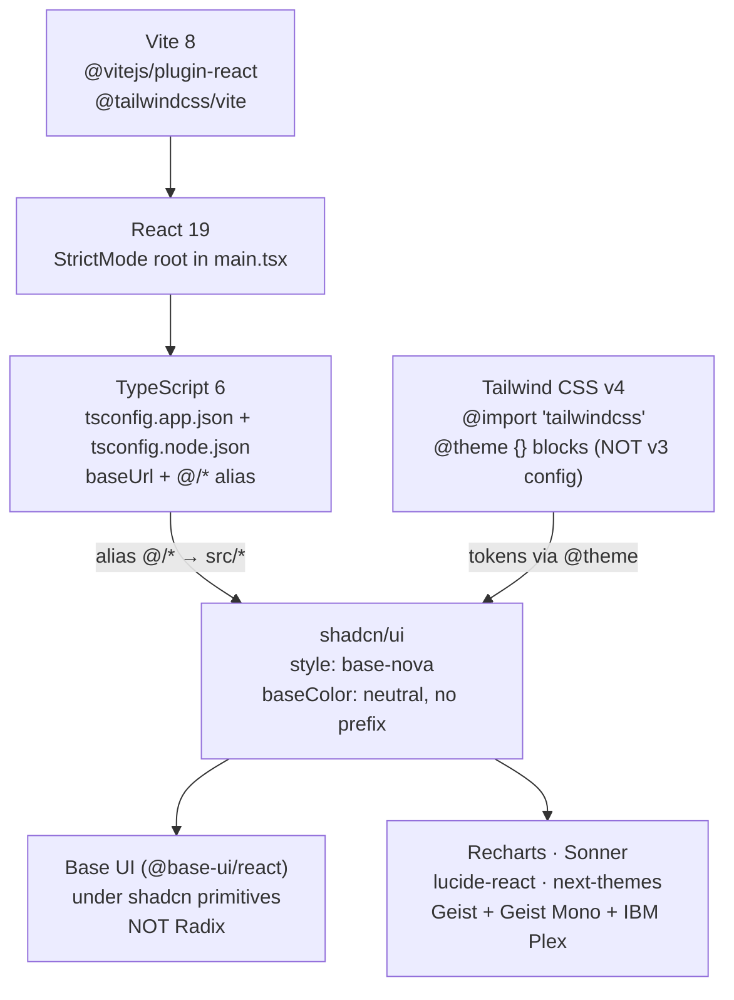
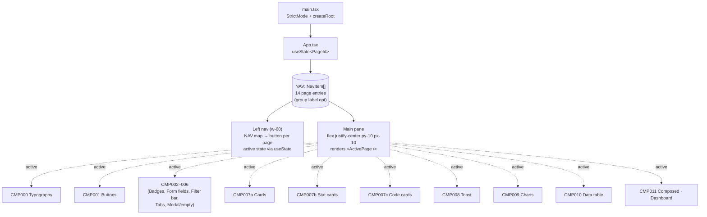
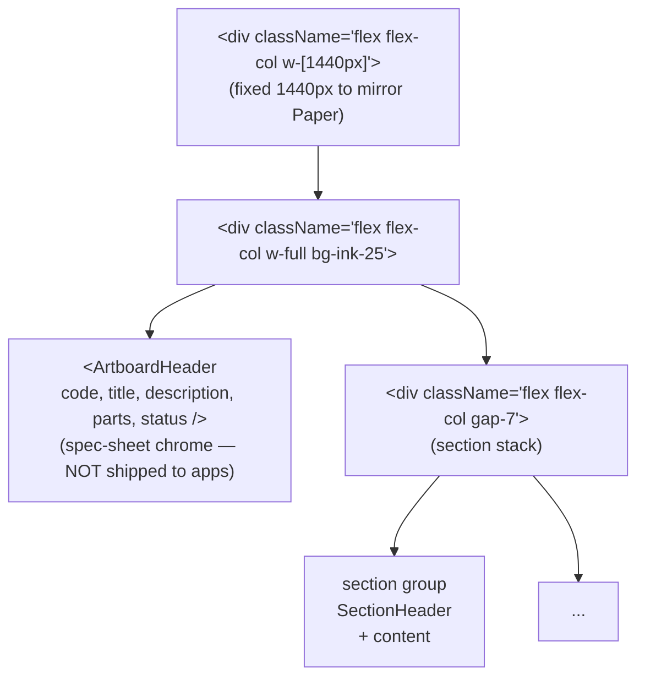
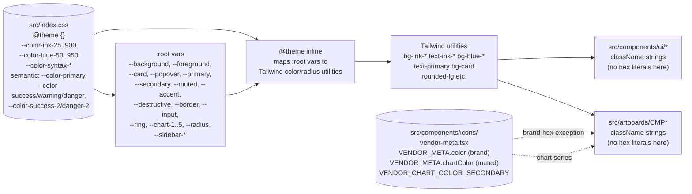
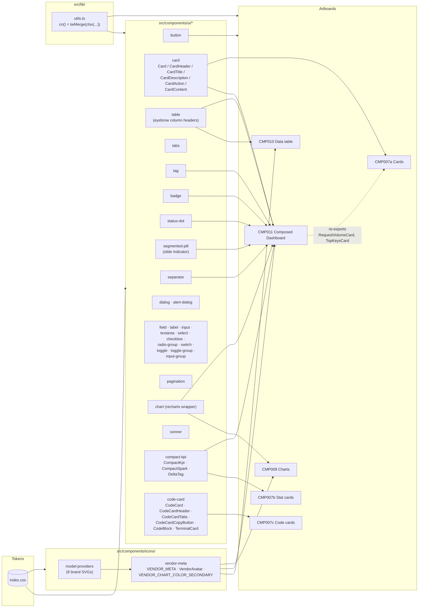
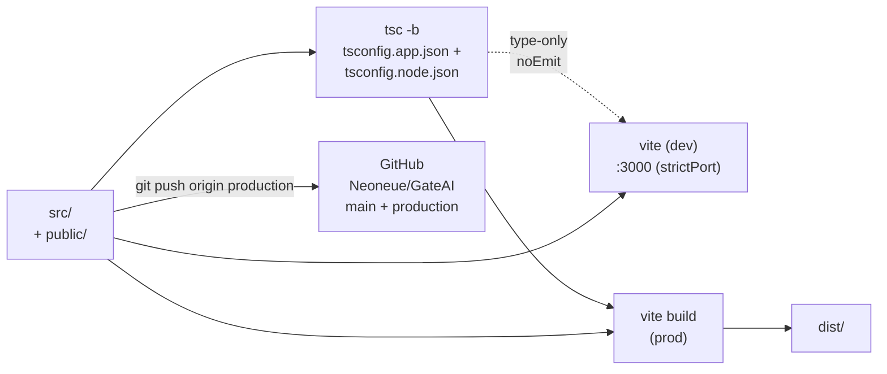

# Data Model — Constellation Gateway Design System

> **Scope:** architecture map for this repo (`mvp` / *Constellation Gateway* / GitHub `Neoneue/GateAI`). Six Mermaid diagrams: stack, app shell, artboard pattern, contract chain, primitive reuse graph, Paper-to-code flow. Update when the project's structure or contract chain changes.

> **Ship boundary:** `src/` is the product. `front-end-developer/` is a vendored design-methodology agent (gitignored) — it ships nothing into the build. `.claude/agents/front-end-developer.md` is the registered subagent that enforces design craft on dispatches.

---

## Mission

A design-system showcase translated section-by-section from a Paper file (*Brilliant quartz*, artboard `v8 Geist-rounded · Showcase`, 1536×12674px). Each `§ CMP-###` block in Paper becomes one React **artboard** page that demonstrates one or more reusable primitives. The build is the catalog *and* the live primitive library — every visible thing on every artboard must trace back to a primitive in `src/components/ui/` or `src/components/icons/`.

Single source of truth for: chart cards, metric cards, KPI tiles, sparklines, status pills, segmented controls, model provider chips, code cards, tables, dashboard composition. Each primitive lives once; artboards consume by import; the dashboard surface (CMP-011) imports from the same primitives the catalog artboards demonstrate.

### Three core principles

1. **Reuse before extract before invent.** If a primitive exists in `src/components/ui/`, use it. If a pattern recurs across 2+ surfaces, extract it. Inline reimplementation is the failure mode.
2. **Tokens, never hex.** Every color/spacing/radius/type choice traces to `src/index.css` `@theme` (or `vendor-meta.tsx` brand colors for external vendors). No raw hex, no orphan `oklch(...)` literals in artboard JSX.
3. **Composed surfaces are arrange-and-wire only.** CMP-011 (Composed Dashboard) ships zero new visual primitives; it imports `RequestVolumeCard`, `TopKeysCard`, `CompactKpi`, `Table`, `Button`, `VendorAvatar`, `Card`, `Tag`, `StatusDot` and arranges them.

---

## 1. Stack



- `npm run dev` → Vite on **port 3000** (user preference; not the 5173 default). Use `npm run dev -- --port 3000 --strictPort`.
- `npm run build` → `tsc -b && vite build`.
- `npm run lint` → `eslint .`.

---

## 2. App shell — `App.tsx` + `main.tsx`

The app has **no router**. Page switching is `useState` over a flat `NAV` array. The active page is rendered into a centered scroll container.



`PageId` is a string union of `'cmp-000' | 'cmp-001' | ... | 'cmp-011'`. `NavItem` is a discriminated union supporting `{ kind: 'page', id, code, name, Component }` and (optional) `{ kind: 'group', label }` separators. The NAV-rendering branches on `kind`; group entries render as a non-clickable eyebrow label.

---

## 3. Artboard pattern — every `CMP*` page is the same shape



**Every artboard:**

- File `src/artboards/CMP{NNN}{PascalName}.tsx`, named export matching filename
- Outer `<div className="flex flex-col w-[1440px]">`
- `<ArtboardHeader code={"CMP-XXX"} title=... description=... parts=... />` from `_shared/ArtboardHeader.tsx`
- One or more `<SectionHeader code={"CMP-XXX.N — TITLE"} hint=... />` blocks delimiting sub-sections
- Content composed entirely from primitives in `src/components/ui/` (or extracted helpers)
- Registered in `src/App.tsx` `NAV[]` (and `PageId` union extended)

Section list (current build):

| Code | File | Purpose |
|---|---|---|
| CMP-000 | `CMP000Typography.tsx` | Type scale + mono-vs-sans |
| CMP-001 | `CMP001Buttons.tsx` | Button variants × sizes × states |
| CMP-002 | `CMP002BadgesAndTags.tsx` | Status pills, counters, chips |
| CMP-003 | `CMP003FormFields.tsx` | Input, textarea, select, check, radio, switch |
| CMP-004 | `CMP004FilterBar.tsx` | Search + chip filters + dropdowns |
| CMP-005 | `CMP005TabsPagination.tsx` | Underline tabs, segmented, pagination |
| CMP-006 | `CMP006ModalEmptyState.tsx` | Modal + empty state |
| CMP-007a | `CMP007aCards.tsx` | Card chrome (chart card + metric/list card) |
| CMP-007b | `CMP007bStatCards.tsx` | Stat cards (compact, flat, stat row, compare, status) |
| CMP-007c | `CMP007cCodeCards.tsx` | Code cards (5 layouts: hero / tabs / terminal / req-resp / steps) |
| CMP-008 | `CMP008Toast.tsx` | Sonner toast deck |
| CMP-009 | `CMP009Charts.tsx` | Spend trend (line+area), Cost by model (stacked) |
| CMP-010 | `CMP010DataTable.tsx` | Sortable table, mono numerics, vendor chips |
| CMP-011 | `CMP011ComposedDashboard.tsx` | Production-shell Overview surface |

---

## 4. Token contract chain



**Authority:** `system.md` (host-level Theme + Project) > `front-end-developer/contract/globals.md` (Layer 1) > `src/index.css` (this repo's globals). Currently `system.md` does not exist; `index.css` is the operative token source. `vendor-meta.tsx` is the only place raw brand hex literals live (intentional — they represent external brand identities, not contract colors).

**Hard rule:** no `#xxxxxx` or `oklch(...)` literals appear in `src/components/ui/*` or `src/artboards/*`. Every color reference resolves through Tailwind utilities or `var(--color-*)` references.

---

## 5. Primitive reuse graph (the load-bearing one)

This is the diagram that proves *every artboard composes from primitives*. Arrows mean "imports from."



**Key reuse loops to call out:**

- **`CompactKpi`** lives in `src/components/ui/compact-kpi.tsx`. Consumed by `CMP007b` (Stat cards) AND `CMP011` KPI rail. Title style (`font-mono font-medium uppercase tracking-[0.1em] text-xs text-ink-500`) is canonical eyebrow.
- **`Card` family** lives in `src/components/ui/card.tsx`. `RequestVolumeCard` and `TopKeysCard` (defined in `CMP011ComposedDashboard.tsx`, **exported** for reuse) are the two card examples in `CMP007a`. Single source of truth — CMP-007a re-imports from CMP-011, no duplication.
- **`VendorAvatar` + `VENDOR_META`** lives in `src/components/icons/vendor-meta.tsx`. Consumed by CMP-009 (model column chips), CMP-010 (Recent requests model column), CMP-011 (Top Keys panel + Recent requests). `VENDOR_META.chartColor` (muted, vendor-derived) feeds the chart series in CMP-008 and CMP-011's Request Volume.
- **`Table` primitive** has Geist Mono uppercase column header treatment baked in — every `<TableHead>` consumer inherits.
- **Code card primitives** (`CodeCard`, `TerminalCard`, `CodeBlock`) live in `code-card.tsx`. CMP-007c is the only consumer today, but the family is structured for reuse on any future code-rendering surface (docs, API references, blog).

---

## 6. Paper → Code flow

```mermaid
sequenceDiagram
    participant U as User
    participant M as Main thread
    participant A as front-end-developer agent
    participant P as Paper MCP
    participant FS as src/artboards/

    U->>M: "Add CMP-XYZ"
    M->>P: get_basic_info, get_tree_summary({nodeId, depth})
    M->>A: dispatch with nodeId, target file path,<br/>existing primitives to reuse
    A->>P: get_screenshot({nodeId, scale: 2}) (visual reference)
    A->>P: get_jsx({nodeId, format: 'tailwind'}) (production code)
    A->>P: get_computed_styles (precision values)
    A->>FS: Write CMPxyz.tsx<br/>- Wrap in &lt;div w-[1440px]&gt;<br/>- ArtboardHeader + SectionHeaders<br/>- Reuse src/components/ui/*<br/>- Adapt to vendor-meta if vendor data
    A->>FS: Update src/App.tsx (NAV + PageId)
    A->>FS: tsc + dev-server screenshot verify
    A->>M: deliverable (file paths, decisions, drift)
    M->>U: confirm done
```

**Source-data rule:** the agent ALWAYS calls `get_jsx(format="tailwind")` + `get_computed_styles` on the source node. Screenshots are for visual verification only, never for tracing values. Paper's JSX output IS production HTML/CSS; the agent's job is adaptation (named export, project imports, primitive swaps, vendor mapping).

---

## 7. Build / dev pipeline



**Branches:**
- `main` — stable line; merge target when production is ready to ship
- `production` — working branch; commits land here first

**Dev-server lifecycle:** main thread responsibility (per CLAUDE.md exception). The orchestrated agent never restarts it.

---

## 8. File tree (current)

```text
mvp/
├── CLAUDE.md                       ← orchestration rules + repo conventions
├── data-model.md                   ← this file
├── README.md                       ← Vite default README (untouched)
├── components.json                 ← shadcn config (style: base-nova)
├── package.json                    ← deps + scripts
├── vite.config.ts                  ← @ alias + plugins
├── tsconfig.{json,app,node}.json
├── eslint.config.js
├── index.html
├── public/
│   ├── favicon.svg
│   └── icons.svg
├── .claude/
│   ├── agents/front-end-developer.md   ← project-scoped subagent (committed)
│   └── settings.local.json             ← gitignored
├── front-end-developer/            ← gitignored vendored agent bundle
│   ├── agent/front-end-developer.md
│   ├── contract/globals.md
│   ├── data-model.md (the agent's own)
│   ├── knowledge/{core,figma,paper,shadcn}/
│   ├── skills/<33 skills>/
│   └── hooks/<5 .sh>/
└── src/
    ├── main.tsx                    ← StrictMode root
    ├── App.tsx                     ← left nav + page swap, NAV array
    ├── index.css                   ← Tailwind v4 imports + @theme tokens
    ├── App.css                     ← (legacy, mostly empty)
    ├── artboards/
    │   ├── _shared/ArtboardHeader.tsx
    │   ├── CMP000Typography.tsx
    │   ├── CMP001Buttons.tsx
    │   ├── CMP002BadgesAndTags.tsx
    │   ├── CMP003FormFields.tsx
    │   ├── CMP004FilterBar.tsx
    │   ├── CMP005TabsPagination.tsx
    │   ├── CMP006ModalEmptyState.tsx
    │   ├── CMP007aCards.tsx
    │   ├── CMP007bStatCards.tsx
    │   ├── CMP007cCodeCards.tsx
    │   ├── CMP008Toast.tsx
    │   ├── CMP009Charts.tsx
    │   ├── CMP010DataTable.tsx
    │   └── CMP011ComposedDashboard.tsx
    ├── components/
    │   ├── canvas/Artboard.tsx     ← absolute-positioned wrapper (zoomable canvas mode; not used by current shell)
    │   ├── icons/
    │   │   ├── model-providers.tsx ← Anthropic/OpenAI/Gemini/Grok/Meta/Mistral/DeepSeek/Cohere SVGs
    │   │   └── vendor-meta.tsx     ← Vendor type + VENDOR_META + VendorAvatar + chartColor maps
    │   └── ui/                     ← 28 shadcn/Base UI primitives
    ├── lib/
    │   ├── utils.ts                ← cn() helper
    │   └── portal-target.tsx
    └── assets/                     ← hero.png, react.svg, vite.svg
```

---

## 9. Cross-references

- **Token decisions:** `src/index.css` (open this when adding/auditing colors)
- **Repo conventions + dispatch rules:** `CLAUDE.md`
- **Design methodology contract:** `.claude/agents/front-end-developer.md` (sourced from `front-end-developer/agent/front-end-developer.md`)
- **Agent skill routing:** `front-end-developer/agent/front-end-developer.md` (skill table near the top)
- **Paper canvas reference:** the Paper file *Brilliant quartz* (`app.paper.design/file/01KQ33WPFNCEZAER8FDFPVW5EP`)

When the project structure changes (new primitive extracted, new artboard added, contract chain shifts, build pipeline changes), update this file. The diagrams should always match the source.
