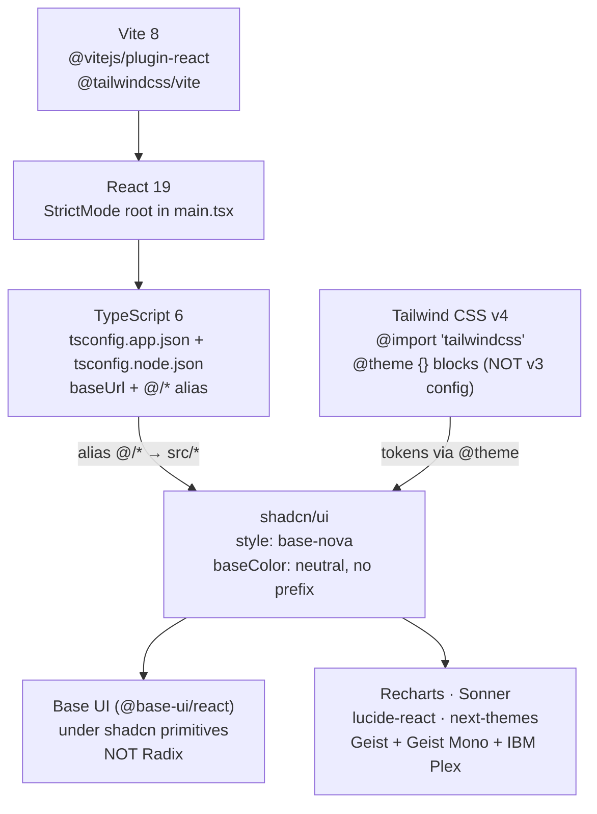
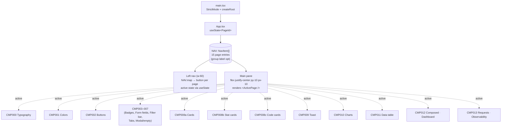
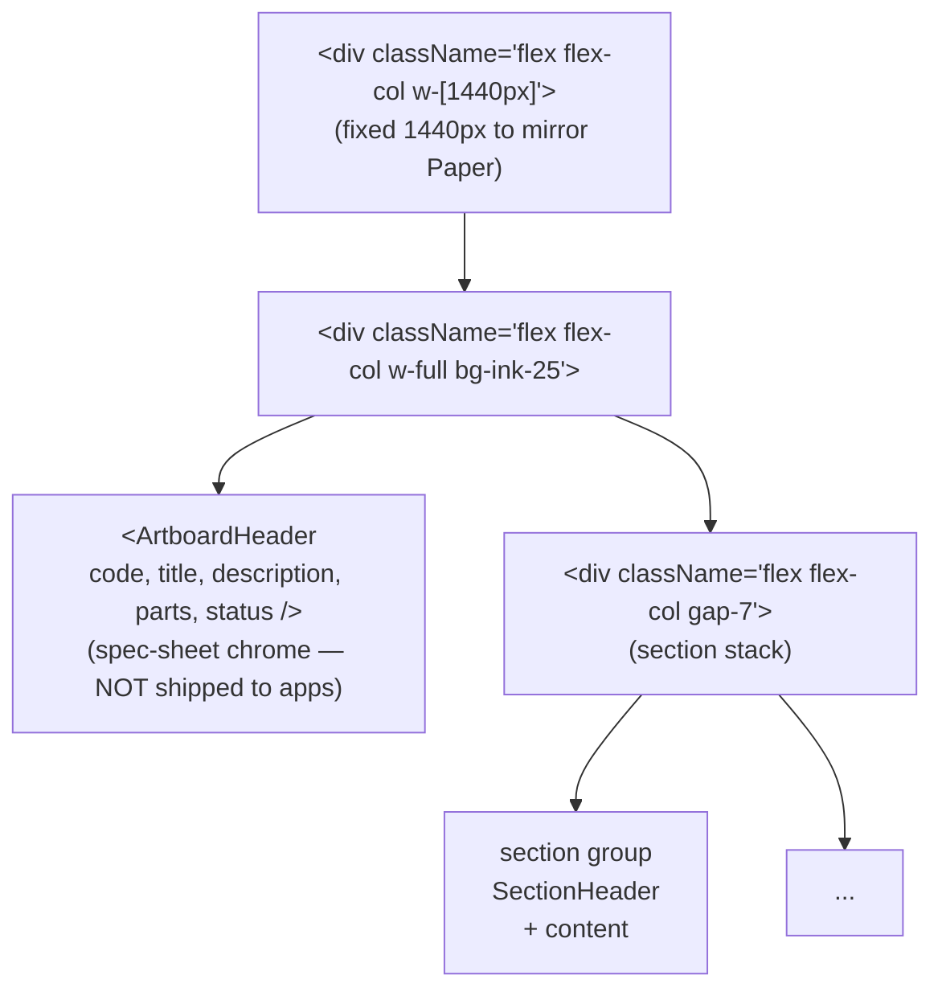
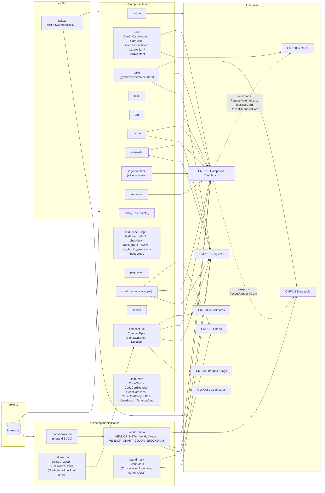
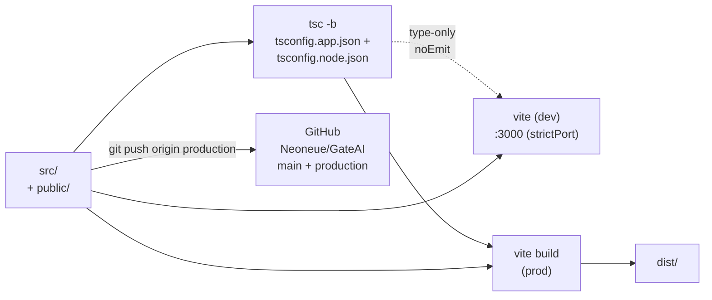

# Data Model — Constellation Gate AI Design System

> **Scope:** architecture map for this repo (`mvp` / *Constellation Gate AI* / GitHub `Neoneue/GateAI`). Six Mermaid diagrams: stack, app shell, artboard pattern, contract chain, primitive reuse graph, Paper-to-code flow. Update when the project's structure or contract chain changes.

> **Ship boundary:** `src/` is the product. `front-end-developer/` is a vendored design-methodology agent (gitignored) — it ships nothing into the build. `.claude/agents/front-end-developer.md` is the registered subagent that enforces design craft on dispatches.

---

## Mission

A design-system showcase translated section-by-section from a Paper file (*Brilliant quartz*, artboard `v8 Geist-rounded · Showcase`, 1536×12674px). Each `§ CMP-###` block in Paper becomes one React **artboard** page that demonstrates one or more reusable primitives. The build is the catalog *and* the live primitive library — every visible thing on every artboard must trace back to a primitive in `src/components/ui/` or `src/components/icons/`.

Single source of truth for: chart cards, metric cards, KPI tiles, sparklines, status pills, segmented controls, model provider chips, code cards, tables, dashboard composition. Each primitive lives once; artboards consume by import; the dashboard surface (CMP-012) imports from the same primitives the catalog artboards demonstrate.

### Three core principles

1. **Reuse before extract before invent.** If a primitive exists in `src/components/ui/`, use it. If a pattern recurs across 2+ surfaces, extract it. Inline reimplementation is the failure mode.
2. **Tokens, never hex.** Every color/spacing/radius/type choice traces to `src/index.css` `@theme` (or `vendor-meta.tsx` brand colors for external vendors). No raw hex, no orphan `oklch(...)` literals in artboard JSX. Type sizes only from Tailwind's named scale (`text-xs`/`sm`/`base`/…/`6xl`); never `text-[Npx]`.
3. **Composed surfaces are arrange-and-wire only.** CMP-012 (Composed Dashboard) ships zero new visual primitives; it imports `RequestVolumeCard`, `TopKeysCard`, `CompactKpi`, `Table`, `Button`, `VendorAvatar`, `Card`, `Tag`, `StatusDot` and arranges them.

---

## 1. Stack



- `npm run dev` → Vite on **port 3000** (user preference; not the 5173 default). Use `npm run dev -- --port 3000 --strictPort`.
- `npm run build` → `tsc -b && vite build`.
- `npm run lint` → `eslint .`.

---

## 2. App shell — `App.tsx` + `main.tsx`

The app has **no router**. Page switching is `useState` over a flat `NAV` array. The active page is rendered into a centered scroll container.



`PageId` is a string union of `'cmp-000' | 'cmp-001' | ... | 'cmp-008a' | 'cmp-008b' | 'cmp-008c' | 'cmp-009' | ... | 'cmp-012' | 'cmp-013'`. `NavItem` is a discriminated union supporting `{ kind: 'page', id, code, name, Component }` and (optional) `{ kind: 'group', label }` separators. The NAV-rendering branches on `kind`; group entries render as a non-clickable eyebrow label.

The shell also has a **collapse toggle** (added 2026-05-05): the sidebar slides closed via `width 240→0` transition; a fixed-position `PanelLeftOpen` button at top-left brings it back. Lets operators view artboards full-bleed.

---

## 3. Artboard pattern — every `CMP*` page is the same shape



**Every artboard:**

- File `src/artboards/CMP{NNN}{PascalName}.tsx`, named export matching filename
- Outer `<div className="flex flex-col w-[1440px]">`
- `<ArtboardHeader code={"CMP-XXX"} title=... description=... parts=... />` from `_shared/ArtboardHeader.tsx`
- One or more `<SectionHeader code={"CMP-XXX.N — TITLE"} hint=... />` blocks delimiting sub-sections
- Content composed entirely from primitives in `src/components/ui/` (or extracted helpers)
- Registered in `src/App.tsx` `NAV[]` (and `PageId` union extended)

Section list (current build):

| Code | File | Purpose |
|---|---|---|
| CMP-000 | `CMP000Typography.tsx` | Type scale (15 specimens) + mono-vs-sans |
| CMP-001 | `CMP001Colors.tsx` | Palette spec sheet — ink + blue ramps, semantic tokens, syntax tokens, vendor brand exception |
| CMP-002 | `CMP002Buttons.tsx` | Button variants × sizes × states |
| CMP-003 | `CMP003BadgesAndTags.tsx` | Status pills, counters, chips |
| CMP-004 | `CMP004FormFields.tsx` | Input, textarea, select, check, radio, switch |
| CMP-005 | `CMP005FilterBar.tsx` | Search + chip filters + dropdowns |
| CMP-006 | `CMP006TabsPagination.tsx` | Underline tabs, segmented, pagination |
| CMP-007 | `CMP007ModalEmptyState.tsx` | Modal (incl. CMP-007.1b Generation details) + empty state |
| CMP-008a | `CMP008aCards.tsx` | Card chrome (chart card + metric/list card) |
| CMP-008b | `CMP008bStatCards.tsx` | Stat cards (compact, flat, stat row, compare, status) |
| CMP-008c | `CMP008cCodeCards.tsx` | Code cards (5 layouts: hero / tabs / terminal / req-resp / steps) |
| CMP-009 | `CMP009Toast.tsx` | Sonner toast deck |
| CMP-010 | `CMP010Charts.tsx` | Spend trend (line+area), Cost by model (stacked) |
| CMP-011 | `CMP011DataTable.tsx` | Three table treatments: sortable list (1), activity feed (2 — re-uses RecentRequestsCard), drill-down panel with severity scoring (3) |
| CMP-012 | `CMP012ComposedDashboard.tsx` | Production-shell Overview surface — 4-card consolidated KPI rail, RequestVolume + TopKeys row, RecentRequests table, Quick Actions section |
| CMP-013 | `CMP013Requests.tsx` | Requests / Observability surface — hero metric card with cumulative chart, sortable request table with row-click drill-in modal (Summary / Messages / Security / Audit tabs) |

---

## 4. Token contract chain

```mermaid
graph LR
    INDEX[("src/index.css<br/>@theme {}<br/>--color-ink-25..900<br/>--color-blue-50..950 (700 = #1F2FCE,<br/>anchored to logomark)<br/>--color-white · --color-canvas<br/>--color-syntax-* · --color-traffic-*<br/>semantic: --color-primary (= ink-900),<br/>--color-success/warning/danger,<br/>--color-success-2/warning-2/danger-2")]
    CSSVARS[":root vars<br/>--background, --foreground,<br/>--card, --popover, --primary,<br/>--secondary, --muted, --accent,<br/>--destructive, --border, --input,<br/>--ring, --chart-1..5, --radius,<br/>--sidebar-*"]
    THEMEINLINE["@theme inline<br/>maps :root vars to<br/>Tailwind color/radius utilities"]
    TWUTILS["Tailwind utilities<br/>bg-ink-* text-ink-* bg-blue-*<br/>text-primary bg-card<br/>rounded-lg etc."]
    PRIMS["src/components/ui/*<br/>className strings<br/>(no hex literals here)"]
    ARTS["src/artboards/CMP*<br/>className strings<br/>(no hex literals here)"]
    VENDOR[("src/components/icons/<br/>vendor-meta.tsx<br/>VENDOR_META.color (brand)<br/>VENDOR_CHART_COLOR_SECONDARY<br/>(only for one-vendor multi-series)")]

    INDEX --> CSSVARS
    INDEX --> THEMEINLINE
    THEMEINLINE --> TWUTILS
    CSSVARS --> THEMEINLINE
    TWUTILS --> PRIMS
    TWUTILS --> ARTS
    VENDOR -.->|brand-hex exception<br/>(chips AND chart series)| ARTS
```

**Authority:** `system.md` (host-level Theme + Project) > `front-end-developer/contract/globals.md` (Layer 1) > `src/index.css` (this repo's globals) + `docs/brand-guidelines.md` (project-side synthesis of decisions in code). Currently `system.md` does not exist; `index.css` is the operative token source, with `brand-guidelines.md` as the human-readable mirror. `vendor-meta.tsx` is the only place raw brand hex literals live (intentional — they represent external brand identities, not contract colors).

**Hard rule (codified 2026-05-05):** **no raw hex / oklch / rgba values outside palette atoms in `@theme`.** Every semantic token in `:root` references a palette atom via `var(--color-*)`. Shadow tokens use `color-mix(in oklch, var(--color-ink-800) X%, transparent)` instead of inline rgba. SVG presentation attributes (`fill="..."` / `stroke="..."` in TSX) accept `var(--color-*)` directly. Dark-mode block was removed (dead code; sonner hardcoded light, no `.dark` class applied anywhere).

**Primary action color:** `--color-primary` and `--primary` resolve to `var(--color-ink-900)` — the project's primary action color is **dark ink, not blue**. Blue is the brand-accent palette only (mark, focus rings, charts, links-that-need-to-stand-out).

**Voice split (codified 2026-05-05):** four typographic voices, each with one job — mono uppercase = section eyebrow; sans Title Case = field/column label; mono normal = ID/value; sans body = content. Sans labels are `font-medium` minimum; `font-normal` reads as ambient body text.

**Vendor color model:** the `VENDOR_META[vendor].color` field is single-source — chips/avatars/badges and chart series both pull from it. There is no separate `chartColor` tier. Twin-hue pairs (Meta + DeepSeek both blue; Anthropic + Mistral both orange) are accepted as the design — each vendor renders in its own brand color, full strength. `VENDOR_CHART_COLOR_SECONDARY` exists only for the case where one vendor is two series in the same chart (e.g. Anthropic Sonnet + Haiku).

---

## 5. Primitive reuse graph (the load-bearing one)

This is the diagram that proves *every artboard composes from primitives*. Arrows mean "imports from."



**Key reuse loops to call out:**

- **`CompactKpi` + `DeltaTag`** live in `src/components/ui/compact-kpi.tsx`. Consumed by `CMP-003` (delta tag spec sheet), `CMP-008b` (Stat cards), `CMP-012` (KPI rail), and `CMP-013` (hero card). Title style (`font-mono font-medium uppercase tracking-[0.1em] text-xs text-ink-500`) is canonical Eyebrow / sm. **DeltaTag** (refactored 2026-05-05) is now a pill-style badge: filled disc icon + value text in a colored wash (`bg-success/15 text-success` for positive, `bg-destructive/15 text-destructive` for negative). Strips leading `+`/`-` since icon and color carry direction. Note ("vs last hour") sits outside the pill at `text-xs text-ink-500`.
- **`Card` family** lives in `src/components/ui/card.tsx`. `RequestVolumeCard`, `TopKeysCard`, and `RecentRequestsCard` (defined in `CMP012ComposedDashboard.tsx`, **exported** for reuse) are consumed by `CMP-008a`, `CMP-011` (RecentRequestsCard for the activity feed section), and `CMP-012`. Single source of truth — CMP-008a / CMP-011 re-import from CMP-012, no duplication.
- **`VendorAvatar` + `VENDOR_META`** lives in `src/components/icons/vendor-meta.tsx`. Consumed by CMP-010 (chart legend chips), CMP-011 (model column with `tone="neutral"` for table density), CMP-012 (Top Keys + Recent requests + Request Volume chart), CMP-013 (Requests table + modal Provider field). The `color` field is single-source. **`tone` prop** added 2026-05-05: `tone="neutral"` (`bg-ink-600`) for in-table density; `tone="brand"` (default) for standalone vendor identification.
- **`BrandMark`** (added 2026-05-05) — Constellation Gate AI logomark in `src/components/icons/brand-mark.tsx`. 7-path constellation SVG with `fill="currentColor"`. Consumed by CMP-012 and CMP-013 left rails (`<BrandMark className="size-8 text-blue-700" />`). Static asset at `public/logomark.svg`. `--color-blue-700` is now anchored to the logomark's exact `#1F2FCE`.
- **`DeltaArrow` icons** (added 2026-05-05) — `DeltaArrowUp` / `DeltaArrowDown` in `src/components/icons/delta-arrow.tsx`. Filled-disc with knockout arrow (`fill-rule="evenodd"`); on a tinted pill bg the arrow shows the wash through, giving a 3-tier color stack (wash → solid disc → pale arrow). Consumed by `DeltaTag` only.
- **`Table` primitive** column header treatment switched 2026-05-05 from mono uppercase to **sans Title Case `font-medium text-ink-600`** (`text-xs`). Mono is now reserved for ID/value content in body cells; sans column heads stay distinct from section eyebrows.
- **Selector primitives with sliding indicators:** `Tabs` default variant, `Segmented` pill variant, and `SegmentedPill` all use a sliding white indicator on selection (added 2026-05-05). `Tabs` uses Base UI's built-in `<TabsPrimitive.Indicator />` driven by `--active-tab-{left,top,width,height}` CSS vars. `Segmented` uses ref-tracking + `useLayoutEffect` (same machinery as `SegmentedPill`).
- **Code card primitives** (`CodeCard`, `TerminalCard`, `CodeBlock`) live in `code-card.tsx`. CMP-008c is the only consumer today, but the family is structured for reuse on any future code-rendering surface (docs, API references, blog).
- **Consolidated row pattern** (added 2026-05-05): single bordered card with internal sections divided by `before:` pseudo-element hairlines at `inset-y-4`. Used by CMP-012's KPI rail (4 cards consolidated into one row) and Quick Actions card (4 task cards consolidated). Replaces the 3/4-up grid-with-gaps pattern when sections share semantic context. The accent treatment on a focal section uses `bg-blue-50` (matches the assistant message bubble fill in CMP-013).
- **`ArtboardHeader` h1** is `text-3xl/9 font-medium` (Page title spec — dropped from text-4xl on 2026-05-04 so KPI numerals anchor the visual hierarchy instead of the title) — propagates to all 16 artboards via the shared header in `_shared/ArtboardHeader.tsx`.

---

## 6. Paper → Code flow

```mermaid
sequenceDiagram
    participant U as User
    participant M as Main thread
    participant A as front-end-developer agent
    participant P as Paper MCP
    participant FS as src/artboards/

    U->>M: "Add CMP-XYZ"
    M->>P: get_basic_info, get_tree_summary({nodeId, depth})
    M->>A: dispatch with nodeId, target file path,<br/>existing primitives to reuse
    A->>P: get_screenshot({nodeId, scale: 2}) (visual reference)
    A->>P: get_jsx({nodeId, format: 'tailwind'}) (production code)
    A->>P: get_computed_styles (precision values)
    A->>FS: Write CMPxyz.tsx<br/>- Wrap in &lt;div w-[1440px]&gt;<br/>- ArtboardHeader + SectionHeaders<br/>- Reuse src/components/ui/*<br/>- Adapt to vendor-meta if vendor data
    A->>FS: Update src/App.tsx (NAV + PageId)
    A->>FS: tsc + dev-server screenshot verify
    A->>M: deliverable (file paths, decisions, drift)
    M->>U: confirm done
```

**Source-data rule:** the agent ALWAYS calls `get_jsx(format="tailwind")` + `get_computed_styles` on the source node. Screenshots are for visual verification only, never for tracing values. Paper's JSX output IS production HTML/CSS; the agent's job is adaptation (named export, project imports, primitive swaps, vendor mapping).

---

## 7. Build / dev pipeline



**Branches:**
- `main` — stable line; merge target when production is ready to ship
- `production` — working branch; commits land here first

**Dev-server lifecycle:** main thread responsibility (per CLAUDE.md exception). The orchestrated agent never restarts it.

---

## 8. File tree (current)

```text
mvp/
├── CLAUDE.md                       ← orchestration rules + repo conventions
├── data-model.md                   ← this file
├── README.md                       ← Vite default README (untouched)
├── components.json                 ← shadcn config (style: base-nova)
├── package.json                    ← deps + scripts
├── vite.config.ts                  ← @ alias + plugins
├── tsconfig.{json,app,node}.json
├── eslint.config.js
├── index.html
├── docs/
│   └── brand-guidelines.md         ← project-side synthesis of brand decisions in code
├── public/
│   ├── favicon.svg
│   ├── icons.svg
│   └── logomark.svg                ← Constellation Gate AI logomark (added 2026-05-05)
├── .claude/
│   ├── agents/front-end-developer.md   ← project-scoped subagent (committed)
│   └── settings.local.json             ← gitignored
├── front-end-developer/            ← gitignored vendored agent bundle
│   ├── agent/front-end-developer.md
│   ├── contract/globals.md
│   ├── data-model.md (the agent's own)
│   ├── knowledge/{core,figma,paper,shadcn}/
│   ├── skills/<33 skills>/
│   └── hooks/<5 .sh>/
└── src/
    ├── main.tsx                    ← StrictMode root
    ├── App.tsx                     ← left nav + page swap, sidebar collapse toggle (2026-05-05)
    ├── index.css                   ← Tailwind v4 imports + @theme tokens
    ├── App.css                     ← (legacy, mostly empty)
    ├── artboards/
    │   ├── _shared/ArtboardHeader.tsx
    │   ├── CMP000Typography.tsx
    │   ├── CMP001Colors.tsx
    │   ├── CMP002Buttons.tsx
    │   ├── CMP003BadgesAndTags.tsx     ← + CMP-003.3 DeltaTag specimen (2026-05-05)
    │   ├── CMP004FormFields.tsx
    │   ├── CMP005FilterBar.tsx
    │   ├── CMP006TabsPagination.tsx
    │   ├── CMP007ModalEmptyState.tsx
    │   ├── CMP008aCards.tsx
    │   ├── CMP008bStatCards.tsx
    │   ├── CMP008cCodeCards.tsx
    │   ├── CMP009Toast.tsx
    │   ├── CMP010Charts.tsx
    │   ├── CMP011DataTable.tsx          ← three layouts (sortable / activity / drill-down)
    │   ├── CMP012ComposedDashboard.tsx  ← consolidated KPI rail + Quick Actions section (2026-05-05)
    │   └── CMP013Requests.tsx           ← Requests / Observability surface (2026-05-05)
    ├── components/
    │   ├── canvas/Artboard.tsx     ← absolute-positioned wrapper (zoomable canvas mode; not used by current shell)
    │   ├── icons/
    │   │   ├── model-providers.tsx ← Anthropic/OpenAI/Gemini/Grok/Meta/Mistral/DeepSeek/Cohere SVGs
    │   │   ├── vendor-meta.tsx     ← Vendor type + VENDOR_META + VendorAvatar (tone: brand | neutral)
    │   │   ├── brand-mark.tsx      ← Constellation logomark (currentColor) — added 2026-05-05
    │   │   └── delta-arrow.tsx     ← DeltaArrowUp/Down (filled-disc + knockout arrow) — added 2026-05-05
    │   └── ui/                     ← 28+ shadcn/Base UI primitives
    ├── lib/
    │   ├── utils.ts                ← cn() helper
    │   └── portal-target.tsx
    └── assets/                     ← hero.png, react.svg, vite.svg
```

---

## 9. Cross-references

- **Token decisions:** `src/index.css` (open this when adding/auditing colors)
- **Brand guidelines (human-readable):** `docs/brand-guidelines.md` (color palette, typography, voice, logo, voice split, layout grid, component conventions — synthesizes what's in code)
- **Repo conventions + dispatch rules:** `CLAUDE.md`
- **Design methodology contract:** `.claude/agents/front-end-developer.md` (sourced from `front-end-developer/agent/front-end-developer.md`)
- **Agent skill routing:** `front-end-developer/agent/front-end-developer.md` (skill table near the top)
- **Paper canvas reference:** the Paper file *Brilliant quartz* (`app.paper.design/file/01KQ33WPFNCEZAER8FDFPVW5EP`)

When the project structure changes (new primitive extracted, new artboard added, contract chain shifts, build pipeline changes), update this file. The diagrams should always match the source.
